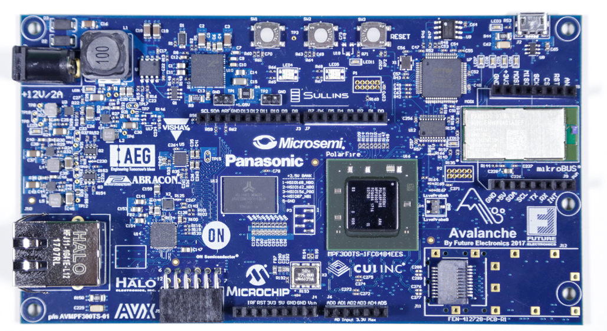
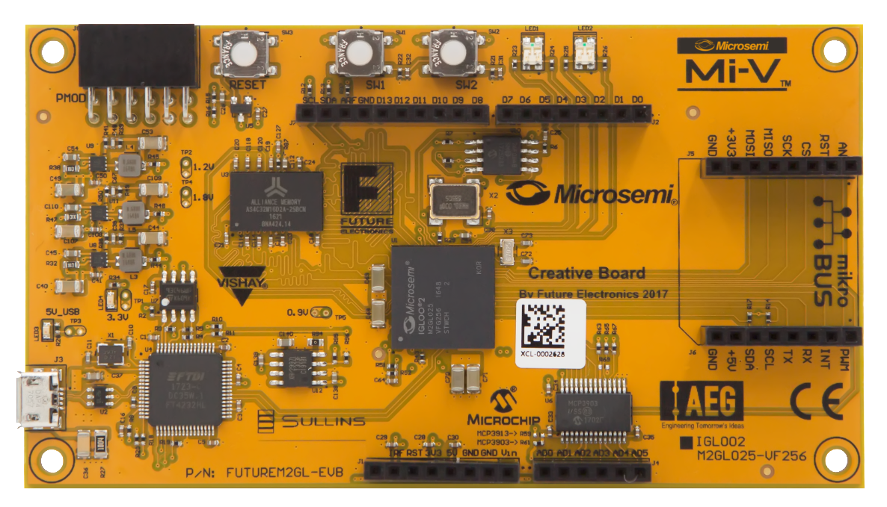
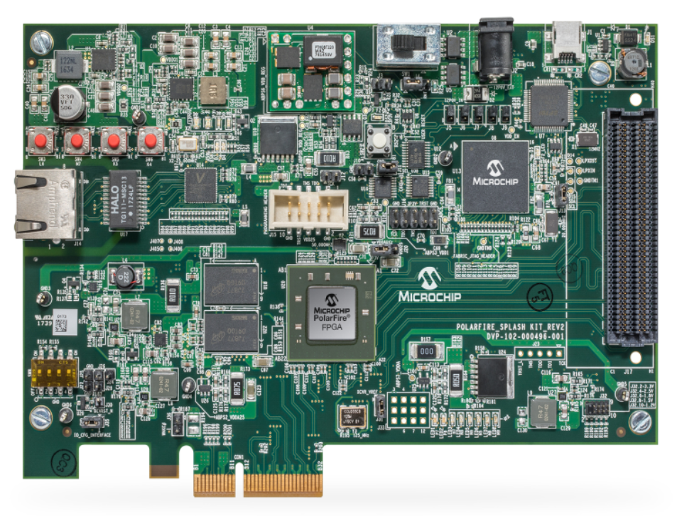
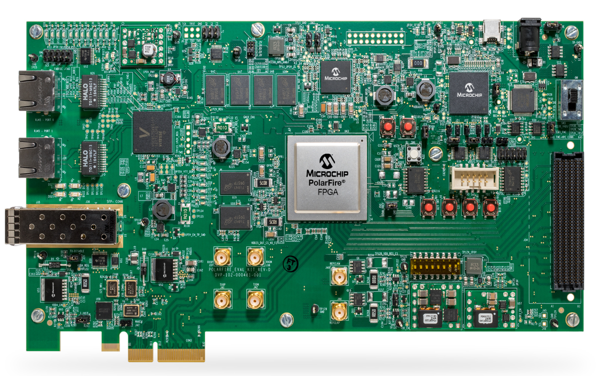
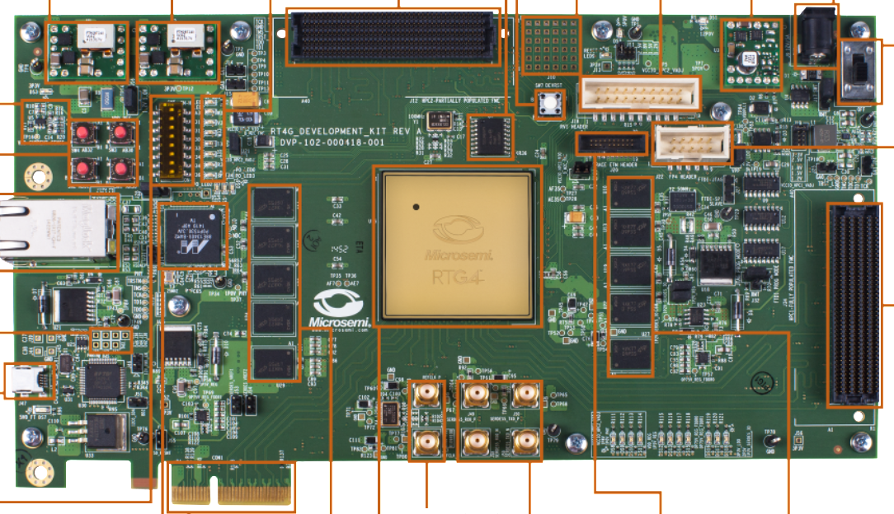
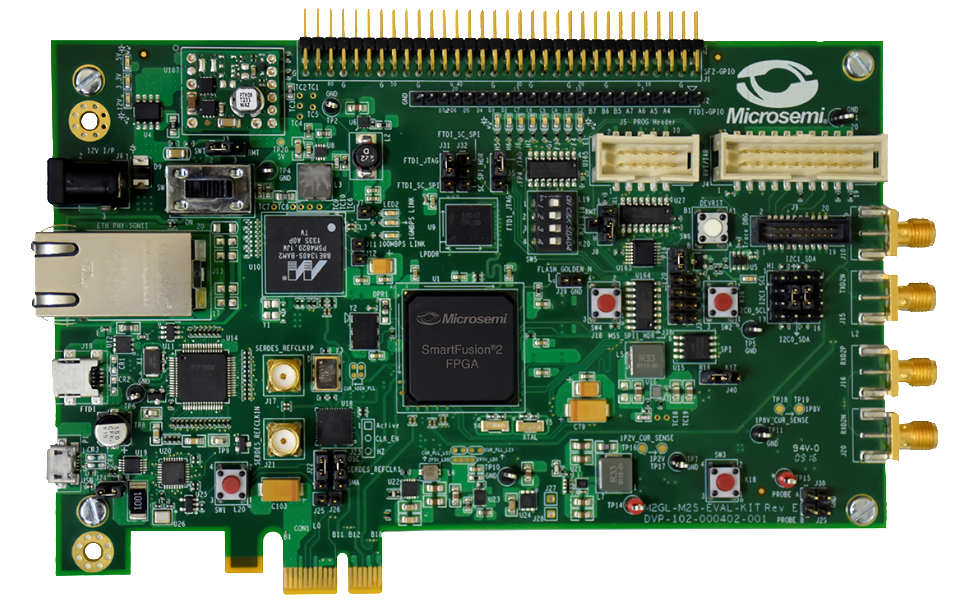
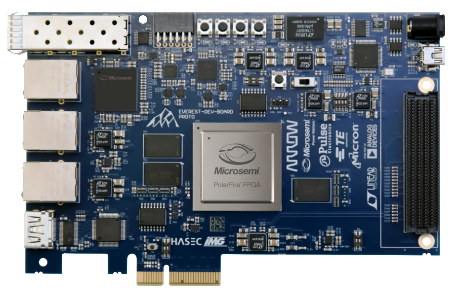

# Hardware Platforms for Libero v12.1
Thiis repository contains sample board designs for Libero v12.1 and support that version of Libero only. The designs can be built with either AXI or AHB buses. These are not fully built projects but, .tcl scripts that need to be executed in Libero to build and implement a project. If you are interested only in the programming files for your device, then download the programming file contained within the selected project's repository and use fpexpress to implement it on your device.
##### Notes
- Check this repository for updates on regular basis.
- Ensure you always have the latest Cores downloaded in Libero.
- Master branch contains latest updates not full releases, scripts are not guaranteed to work.
- If you have any queries be sure to jest the [F.A.Q's](https://github.com/MiV-Libero-Designs/Sample-Board-Solutions/tree/master/FAQ) page in the repository

## Instructions
1. Select one of the sample board designs from the list below by clicking on it's name.
2. Download or Clone the selected repository, extract it wherever you want your Libero project built.
3. Follow the instructions on the project's page to implement the design, ensure your version of Libero matches the version for which the scripts are written.

------------------------------------------
### [AVMPF300TS_01](https://github.com/MiV-Libero-Designs/AVMPF300TS_01)
This is the Future Avalanche Board for PolarFire FPGA - AVMPF300TS_01. Information like data sheets, guides and support for this board can be found by clicking here, [Microsemi's website](https://www.microsemi.com/existing-parts/parts/139680). A Libero Gold license is required to use the PolarFire part.

- The operational clock frequency of the design is 50 MHz
- Latest cores have been implemented
- Part used: MPF300TS-FCG484EES
- Timing seed included, more information on the design's page.

---------------------------------------------
### [FUTUREM2GL_EVB](https://github.com/MiV-Libero-Designs/FUTUREM2GL_EVB)
This is a Future designed IGLOO2 RISC-V Creative Development Board for IGLOO2 FPGA - FUTUREM2GL_EVB. Information like data sheets, guides and support for this board can be found by clicking here, [Microsemi's website](https://www.microsemi.com/existing-parts/parts/143948). Below is an image of the board.

- The frequency of the design is 50 MHz
- Latest cores have been implemented
- This board can come in colors: red, yellow or blue
- Part used: M2GLO25
- Timing seed included, more information on the design's page.

----------------------------------------------
### [M2S150TS_ADV_DEV_KIT](https://github.com/MiV-Libero-Designs/M2S150TS_ADV_DEV_KIT)
This board is a SmartFusion2 Advanced Development Kit - SoC FPGA 150K LE - M2S150TS_ADV_DEV_KIT. Information like data sheets, guides and support for this board can be found by clicking here, [Microsemi's website](https://www.microsemi.com/existing-parts/parts/143709). Below is an image of the board.

- The frequency of the design is 50 MHz
- Latest cores have been implemented
- Contains Core SPI
- Design uses the MSS Subsystem
- Part used: M2S150TS-1FC1152I
- Timing seed included, more information on the design's page.

----------------------------------------------
### [MPF300_SPLASH_KIT_ES](https://github.com/MiV-Libero-Designs/MPF300_SPLASH_KIT_ES)
This is Microsemi's PolarFire Splash Kit board for evaluation and development. Information like data sheets, guides and support for this board can be found by clicking here, [Microsemi's website](https://www.microsemi.com/existing-parts/parts/144001). Below is an image of the board.

- The frequency of the design is 50 MHz
- Latest cores have been implemented
- This is project is marked 'ES' for Engineering Sample
- Part used: MPF300TS-1FCG484EES
- Timing seed included, more information on the design's page.

----------------------------------------------
### [MPF300-EVAL-KIT](https://github.com/MiV-Libero-Designs/MPF300_EVAL_KIT/tree/Libero-v12.1)
This is Microsemi's PolarFire FPGA Evaluation Kit. Information like data sheets, guides and support for this board can be found by clicking here, [Microsemi's website](https://www.microsemi.com/existing-parts/parts/150789). Below is an image of the board.

- The frequency of the design is 50 MHz
- Latest cores have been implemented
- Part used: MPF300TS-1FCG484E
- Timing seed included, more information on the design's page.

----------------------------------------------
### [RTG4_DEV_KIT](https://github.com/MiV-Libero-Designs/RTG4_DEV_KIT)
This is a Radiation-Tolerant High-Density High-Performance Development Board with one RT4G150 FPGA. Information like data sheets, guides and support for this board can be found by clicking here, [Microsemi's website](https://www.microsemi.com/product-directory/dev-kits-solutions/3865-rtg4-kits#overview). Below is an image of the board 

- The frequency of the design is 50 MHz
- Latest cores have been implemented
- Timing seed included, more information on the design's page.

-----------------------------------------------
### [M2S090TS_EVAL_KIT](https://github.com/MiV-Libero-Designs/M2S090TS_EVAL_KIT)
This is a SmartFusion2 Security Evaluation Kit - SoC FPGA 90K LE. Information like data sheets, guides and support for this board can be found by clicking here, [Microsemi's website](https://www.microsemi.com/existing-parts/parts/143988). Below is an image of the board.

- The frequency of the design is 50 MHz
- Contains Core SPI
- Latest cores have been implemented
- The design uses the MSS Subsystem
- Timing seed included, more information on the design's page. 

------------------------------------------------
### [EVMPF300_DEV_KIT_ES](https://github.com/MiV-Libero-Designs/EVMPF300_DEV_KIT_ES)
This is an Arrow Everest Evaluation Board for PolarFire FPGA. Information like data sheets, guides and support for this board can befound by clicking here, [Microsemi's website](https://www.microsemi.com/existing-parts/parts/143998). Below is an image of the board.

- The frequency of the design is 50 MHz
- Latest cores have been implemented
- This is project is marked 'ES' for Engineering Sample
- Timing seed included, more information on the design's page.

-------------------------------------------------
