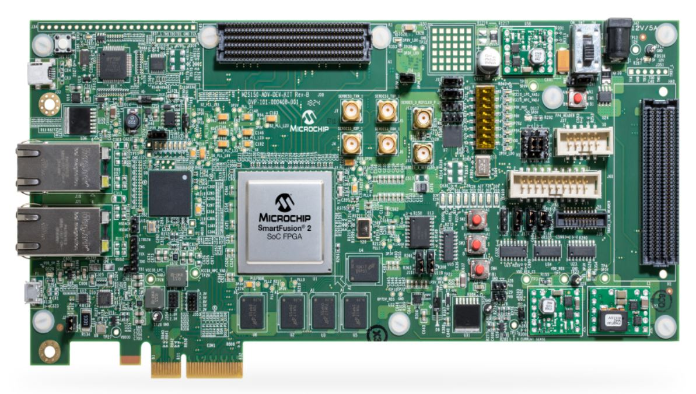

# Hardware Platforms
This repository contains a list of sample board designs for Libero. The sample designs contain Libero projects for FPGA designs including a RISC-V soft processor with programming bitstreams that can be used to program hardware using FlashPro Express. Select the hardware platform and follow instructions on it's page to implement it.
##### Notes
- Check this repository for updates on regular basis.
- Ensure you always have the latest Cores downloaded in Libero.
- Develop branch contains latest updates, master branch contains releases.
- If you have any queries be sure to check the **[F.A.Q's](https://github.com/RISCV-on-Microsemi-FPGA/Hardware-Platforms/tree/develop/FAQ)** page in the repository

## Instructions
1. Select one of the sample board designs from the list below by clicking on it's name.
2. Download or Clone the selected repository, extract it wherever you want your Libero project built.
3. Follow the instructions on the project's page to implement the design, ensure your version of Libero matches the version for which the scripts are written.

-------------------------------------------------
### [PolarFire-Eval-Kit](https://github.com/RISCV-on-Microsemi-FPGA/PolarFire-Eval-Kit)
This is Microsemi's PolarFire FPGA Evaluation Kit. Information like data sheets, guides and support for this board can be found by clicking here, [Microsemi's website](https://www.microsemi.com/existing-parts/parts/150789). Below is an image of the board.

- The frequency of the design is 50 MHz
- Latest cores have been implemented
- LSRAM for data and memory initialization
- FPGA: MPF300T or MPF300T_ES
- A soft RISC-V [processor](https://github.com/RISCV-on-Microsemi-FPGA/CPUs)

-------------------------------------------------
### [Future-Avalanche-Board](https://github.com/RISCV-on-Microsemi-FPGA/Future-Avalanche-Board)
This is the Future Avalanche Board for PolarFire FPGA - AVMPF300TS_01. Information like data sheets, guides and support for this board can be found by clicking here, [Microsemi's website](https://www.microsemi.com/existing-parts/parts/139680). A Libero Gold license is required to use the PolarFire part.

- The operational clock frequency of the design is 50 MHz
- Latest cores have been implemented
- LSRAM for data and memory initialization
- A soft RISC-V [processor](https://github.com/RISCV-on-Microsemi-FPGA/CPUs)

-------------------------------------------------
### [PolarFire-FPGA-Splash-Kit](https://github.com/RISCV-on-Microsemi-FPGA/PolarFire-FPGA-Splash-Kit)
This is Microsemi's PolarFire Splash Kit board for evaluation and development. Information like data sheets, guides and support for this board can be found by clicking here, [Microsemi's website](https://www.microsemi.com/existing-parts/parts/144001). Below is an image of the board.

- The frequency of the design is 50 MHz
- Latest cores have been implemented
- LSRAM for data and memory initialization
- This is project is marked 'ES' for Engineering Sample
- A soft RISC-V [processor](https://github.com/RISCV-on-Microsemi-FPGA/CPUs)

-------------------------------------------------
### [Arrow-Everest-Board](https://github.com/RISCV-on-Microsemi-FPGA/Arrow-Everest-Board)
This is an Arrow Everest Evaluation Board for PolarFire FPGA. Information like data sheets, guides and support for this board can befound by clicking here, [Microsemi's website](https://www.microsemi.com/existing-parts/parts/143998). Below is an image of the board.

- The frequency of the design is 50 MHz
- Latest cores have been implemented
- LSRAM for data and memory initialization
- This is project is marked 'ES' for Engineering Sample
- A soft RISC-V [processor](https://github.com/RISCV-on-Microsemi-FPGA/CPUs)

-------------------------------------------------
### [RISC-V-Creative-Board](https://github.com/RISCV-on-Microsemi-FPGA/RISC-V-Creative-Board)
This is a Future designed IGLOO2 RISC-V Creative Development Board for IGLOO2 FPGA - FUTUREM2GL_EVB. Information like data sheets, guides and support for this board can be found by clicking here, [Microsemi's website](https://www.microsemi.com/existing-parts/parts/143948). Below is an image of the board.

- The frequency of the design is 50 MHz
- Latest cores have been implemented
- LSRAM for data and memory initialization
- This board can come in colors: red, yellow or blue
- A soft RISC-V [processor](https://github.com/RISCV-on-Microsemi-FPGA/CPUs)

-------------------------------------------------
### [SmartFusion2-Advanced-Dev-Kit](https://github.com/RISCV-on-Microsemi-FPGA/SmartFusion2-Advanced-Dev-Kit)
This board is a SmartFusion2 Advanced Development Kit - SoC FPGA 150K LE - M2S150TS_ADV_DEV_KIT. Information like data sheets, guides and support for this board can be found by clicking here, [Microsemi's website](https://www.microsemi.com/existing-parts/parts/143709). Below is an image of the board.

- The frequency of the design is 50 MHz
- Latest cores have been implemented
- LSRAM for data and memory initialization
- FPGA: M2S150 or M2S150TS
- A soft RISC-V [processor](https://github.com/RISCV-on-Microsemi-FPGA/CPUs)

-------------------------------------------------
### [RTG4-Development-Kit](https://github.com/RISCV-on-Microsemi-FPGA/RTG4-Development-Kit)
This is a Radiation-Tolerant High-Density High-Performance Development Board with one RT4G150 FPGA. Information like data sheets, guides and support for this board can be found by clicking here, [Microsemi's website](https://www.microsemi.com/product-directory/dev-kits-solutions/3865-rtg4-kits#overview). Below is an image of the board 

- The frequency of the design is 50 MHz
- Latest cores have been implemented
- LSRAM for data and memory initialization
- A soft RISC-V [processor](https://github.com/RISCV-on-Microsemi-FPGA/CPUs)

-------------------------------------------------
### [SmartFusion2-Eval-Kit](https://github.com/RISCV-on-Microsemi-FPGA/SmartFusion2-Eval-Kit)
This is a SmartFusion2 Security Evaluation Kit - SoC FPGA 90K LE. Information like data sheets, guides and support for this board can be found by clicking here, [Microsemi's website](https://www.microsemi.com/existing-parts/parts/143988). Below is an image of the board.

- The frequency of the design is 50 MHz
- Latest cores have been implemented
- LSRAM for data and memory initialization
- FPGA: M2S090 or M2S090TS
- A soft RISC-V [processor](https://github.com/RISCV-on-Microsemi-FPGA/CPUs)

-------------------------------------------------
